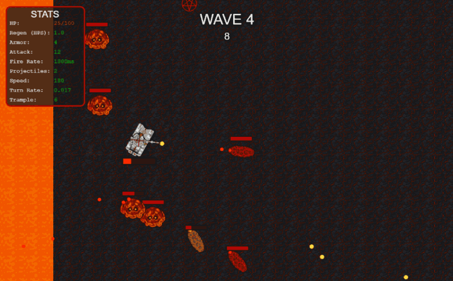
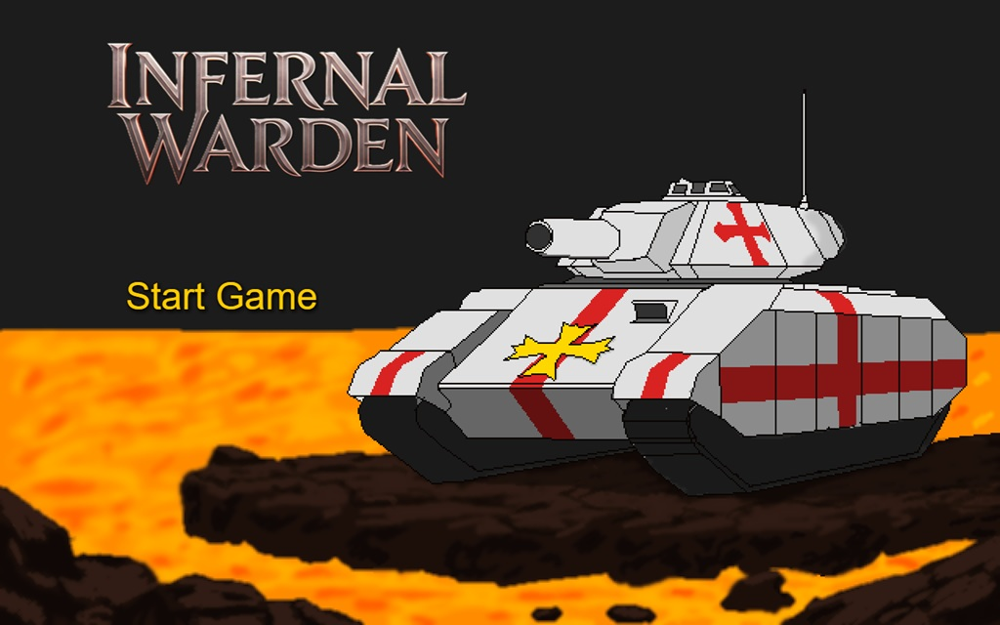
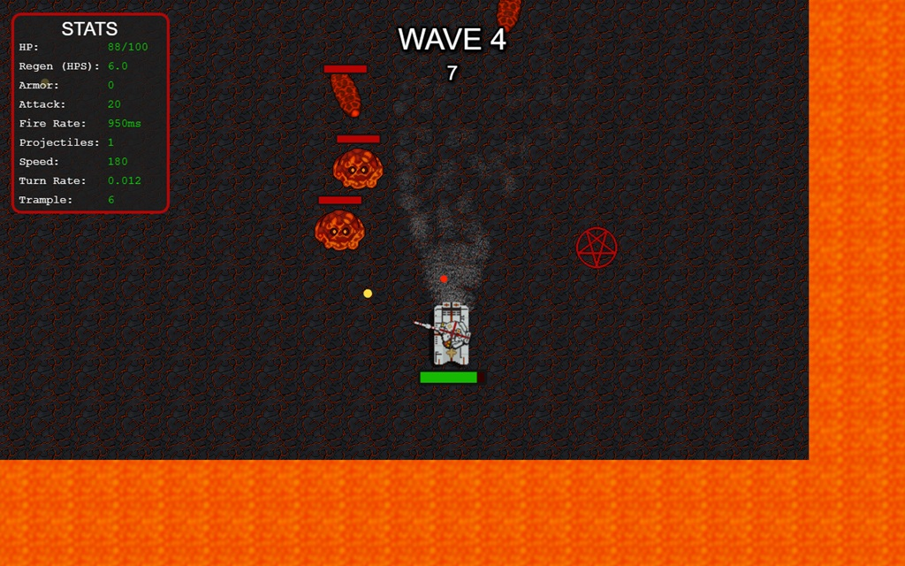
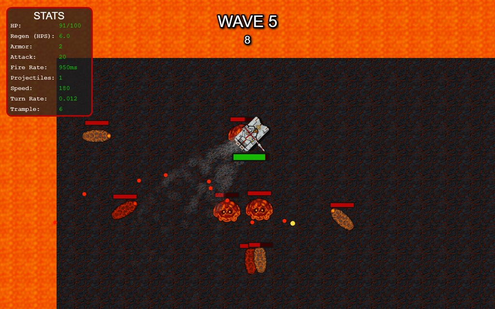

# Infernal Warden - Survive the Magma Arena

[Play the game here!](https://olekodehode.github.io/Infernal-Warden/)

A top down arena survival shooter with upgrades.

Infernal Warden is a small and simple arena shooter made during a small Game Jam while I attended the [KodeHode](https://www.kodehode.no) Web Developer course.
The Game Jam duration was about a week, and we were allowed to use any tool at our disposal.

My initial idea of it was "_(Autonomous) Tank sent on a crusade to Hell, to cull its' forces before they spilled into our reality_".

## Features

- Wave Based survival shooter with a top down prespective (Timer Based)
- 2 Enemy Types: One shooting enemy and one chasing enemy.
- 10 different upgrade types and 3 rarities. (31 different upgrades)
- Scaling enemy Health & Damage
- Partial Gamepad support: Steer and Shoot with a gamepad. Didn't have time to add menu navigation with gamepad however.
- Auto-Fire toggle

### Controls

The tank steers based on the direction you input (W for North, D for East etc.) rather than true tank-controls.

**Keyboard & Mouse:**

- WASD for steering.
- Mouse for Aiming.
- Left Mouse click for shooting.
- Space to toggle auto-fire.
- Esc to pause the game.

**Gamepad (xbox):**

- Left stick for steering.
- Right stick for aiming.
- A to shoot.
- B to toggle auto-fire.
- Start to pause the game.

### Media

|                    Main Menu                     |                       Gameplay                       |                       Gameplay2                       |
| :----------------------------------------------: | :--------------------------------------------------: | :---------------------------------------------------: |
|  |  |  |

### TechStack

Made with Phaser 3.9, using the Phaser Editor and VSCode, with liberal use of LLMs to help me get the game done in time.

Used Aseprite for sprites and textures, using AI generated pictures as a base to modify due to lack of artistic skills.

### How to Run

Play the game through my [Github Pages](https://olekodehode.github.io/Infernal-Warden/) link, or clone the project and run the game off of Live Server.

### Credits

Project made by me during a small game jam at Kodehode.
Special thanks to Gemini and Grok for all the help.

Art was traced or modified based on generated pictures from either model.

No music or sound effects as of now - If I add in anything, I'll make sure to add in credits here :)
